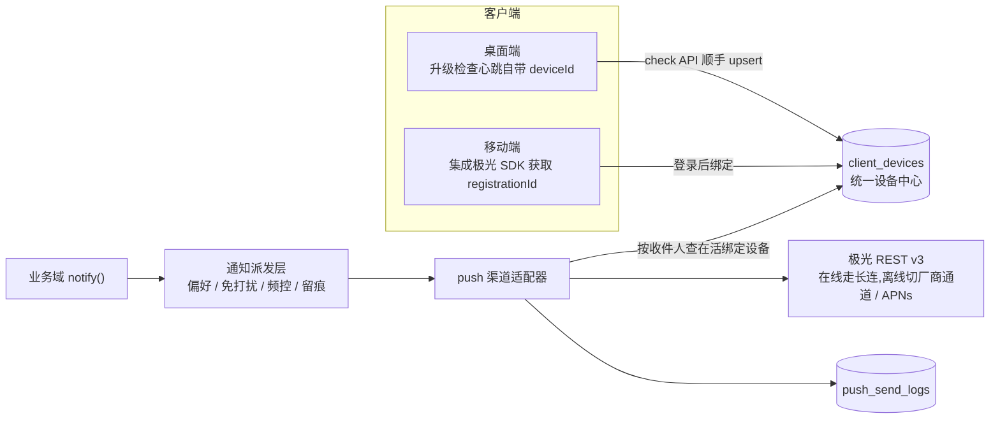

# App 推送

App 推送是通知中心的 `push` 渠道：业务事件经 `notify()` 统一派发，推送适配器把消息投递到移动 / 桌面客户端。国内安卓生态下进程被杀后只有系统级厂商通道可达，因此采用「聚合供应商」方案——服务端只对接极光（JPush）REST API，华为 / 小米 / OPPO / vivo / 荣耀厂商通道与 APNs 凭证全部配置在极光后台，服务端零感知。

事实来源以 `packages/server/src/lib/push-sender.ts`、`packages/server/src/lib/notification/adapters/push.adapter.ts`、`packages/server/src/services/messaging/push-configs.service.ts`、`packages/server/src/services/ops/client-devices.service.ts` 为准。

## 架构



| 层 | 位置 | 职责 |
| --- | --- | --- |
| 发送适配 | `lib/push-sender.ts` | 极光 REST v3（Basic Auth），单批上限 1000 设备自动分批；provider 接口可插拔 |
| 渠道适配器 | `lib/notification/adapters/push.adapter.ts` | 收件人 → 在活绑定设备寻址，多设备聚合一次投递，成败回写发送记录 |
| 配置与记录 | `services/messaging/push-configs.service.ts`、`push-send-logs.service.ts` | 凭证管理（脱敏、唯一默认、APNs 环境）、测试发送、发送流水查询 |
| 统一设备中心 | `services/ops/client-devices.service.ts` | 设备档案 upsert、推送绑定 / 解绑、在活寻址、升级看板取数 |

## 统一设备中心

设备是一等公民：升级灰度、App 推送与在网统计共用一张 `client_devices` 表，锚点是客户端生成并持久化的匿名 `deviceId`。

三个写入口：

1. **升级检查心跳**：`GET /api/public/app-releases/check` 携带 `deviceId` 时自动 upsert 平台 / 架构 / 版本 / 活跃时间——桌面端零改动即被登记；
2. **登录绑定推送**：移动端集成推送 SDK 后，登录成功调绑定接口写入 `subjectType/subjectId + pushRegistrationId`；同一 `registrationId` 换机重装会自动从旧设备迁移；
3. **登出解绑**：清除绑定人，设备档案保留（无主体的设备对推送不可达）。

管理端入口：系统设置 → 应用版本 → **设备** Tab，支持按应用 / 平台 / 绑定人 / 推送绑定筛选、解绑推送与删除档案。

## 服务端 API

### 管理接口（登录 + 权限）

| 方法与路径 | 权限 | 说明 |
| --- | --- | --- |
| `GET/POST/PUT/DELETE /api/push-configs` | `system:push:*` | 推送配置 CRUD，`masterSecret` 编辑留空表示不更新 |
| `PUT /api/push-configs/{id}/default` | `system:push:update` | 设为默认（全局唯一） |
| `POST /api/push-configs/{id}/test` | `system:push:send` | 测试发送，直发指定 RegistrationID |
| `GET /api/push-send-logs` | `system:push-log:list` | 发送记录（状态 / 时间 / 关键字筛选） |
| `GET /api/app-releases/devices` | `system:app-release:list` | 设备列表 |
| `PUT /api/app-releases/devices/{id}/unbind` | `system:app-release:update` | 强制解绑推送 |
| `DELETE /api/app-releases/devices/{id}` | `system:app-release:delete` | 删除设备档案 |

### 客户端绑定接口（登录态即可，无权限点）

| 方法与路径 | 认证 | 说明 |
| --- | --- | --- |
| `POST /api/push/devices` | 管理端 token | 绑定推送设备（移动审批等管理员身份客户端） |
| `DELETE /api/push/devices/{deviceId}` | 管理端 token | 登出解绑 |
| `POST /api/member/push/devices` | 会员会话 | 会员端绑定 |
| `DELETE /api/member/push/devices/{deviceId}` | 会员会话 | 会员端解绑 |

绑定请求体：

```json
{
  "app": "zenith-mobile",
  "deviceId": "客户端持久化的匿名设备标识",
  "provider": "jpush",
  "registrationId": "极光 SDK 返回的 RegistrationID",
  "platform": "android",
  "deviceModel": "Xiaomi 15",
  "osVersion": "Android 15",
  "appVersion": "1.10.0",
  "pushEnabled": true
}
```

## 事件接入

`push` 已注册进通知渠道枚举，业务事件在 `availableChannels` 声明后即可被用户 / 管理员开启。首批开放：

| 事件 | 说明 |
| --- | --- |
| `workflow.task.created` | 收到新待办审批 |
| `workflow.task.urged` | 待办被催办 |
| `ops.monitor.alert` | 系统监控告警（必达） |
| `ops.error.alert` | 前端错误监控告警（必达） |

业务侧无需感知推送细节——`notify()` 派发时若收件人开启了 push 渠道且有在活绑定设备，适配器自动投递；无设备按 `unreachable` 留痕。需要覆盖推送标题或附加透传参数时使用 `channelOptions.push`：

```ts
await notify('workflow.task.created', {
  recipients,
  vars,
  link: `/approval/tasks/${task.id}`,   // 自动映射为推送点击跳转（extras.link）
  channelOptions: {
    push: { title: '待办提醒', extras: { taskId: String(task.id) } },
  },
});
```

## 管理端配置流程

1. 在[极光控制台](https://www.jiguang.cn/)创建应用，厂商通道（华为 / 小米 / OPPO / vivo / 荣耀）与 APNs 证书按极光文档配置在极光后台；
2. 系统设置 → 通知管理 → **App 推送 → 推送配置**：录入 AppKey / MasterSecret，选择 APNs 环境（开发 / 生产），设为默认；
3. 用「测试发送」直发一台真机的 RegistrationID 验证通道；
4. 系统设置 → 通知管理 → 通知策略：按需锁定 / 开放各事件的 App 推送渠道；用户在个人偏好中自行开关；
5. 发送流水与失败原因在 **App 推送 → 推送记录** 查看，投递决策（含 `unreachable` / 频控 / 免打扰）在通知策略 → 投递日志。

## 客户端接入（移动端）

1. 集成极光 SDK（Android / iOS），初始化后获取 `RegistrationID`；
2. 登录成功后调用绑定接口上报（见上文请求体）；登出时调用解绑接口；
3. 通知点击事件读取 `extras.link`，在应用内路由跳转;
4. 用户在 App 设置中关闭推送时，重新绑定并传 `pushEnabled: false`（保留绑定但停止投递）。

## 数据保留

| 数据 | 策略 |
| --- | --- |
| `push_send_logs` | 默认保留 180 天（系统设置 → 数据保留可调） |
| `client_devices` | 按 `last_active_at` 裁剪 180 天不活跃设备；设备重新上线会自动重新登记 |
