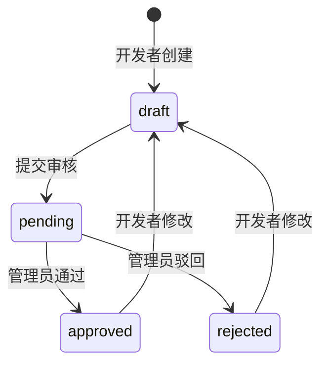

# 应用与凭证

开放平台应用存储在 `oauth2_clients`，同时承载 OAuth2 Client、开放网关 AppKey 与 HMAC 签名密钥。

---

## 应用字段

| 字段 | 说明 |
| --- | --- |
| `clientId` | UUID，作为 OAuth2 `client_id`，也是 HMAC 签名通道的 `X-App-Key` |
| `clientSecret` | 机密客户端的一次性明文密钥；数据库保存 SHA-256 摘要与 AES-256-GCM 密文 |
| `redirectUris` | 授权码模式允许的回调 URL，最多 20 个 |
| `allowedScopes` | 应用可申请 / 可调用的 Scope 集合 |
| `grantTypes` | `authorization_code`、`client_credentials`、`refresh_token` |
| `isPublic` | 公开客户端无 secret，必须使用 PKCE，不支持客户端凭证与 HMAC |
| `ratePlanId` | 绑定的限流套餐；为空时使用默认套餐 |
| `signEnabled` | 是否启用 `X-App-Key` + HMAC 签名通道 |
| `ipAllowlist` | 开放 API 来源 IP/CIDR 白名单；空数组表示不限制 |
| `environment` | `production` 或 `sandbox` |
| `reviewStatus` | `draft`、`pending`、`approved`、`rejected` |
| `status` | `enabled` 或 `disabled` |
| `ownerId` | 应用归属用户 |

## 应用状态

- 自助创建应用保存为 `draft`。
- `pending` 状态下开发者不能修改或删除应用。
- 驳回必须填写审核意见。
- 应用修改会回到 `draft`，并撤销存量令牌与授权码。

## 生产与沙箱

| 环境 | 网关审核要求 | 限流 |
| --- | --- | --- |
| `production` | 当 `OPEN_GATEWAY_REQUIRE_APPROVAL=true` 时必须 `approved` | 执行套餐 QPS / 日 / 月配额 |
| `sandbox` | HMAC 网关不因环境要求审核通过；OAuth2 标准端点仍按应用可用性校验 | 跳过套餐限流 |

## 密钥与轮换

- `clientSecret` 只在创建或重置时返回一次。
- 重置密钥会生成新 secret，并把旧 secret 放入宽限窗口。
- 宽限窗口由 `OPEN_SECRET_ROTATION_GRACE_HOURS` 控制，默认 24 小时。
- 重置密钥会撤销该应用存量令牌族、令牌和授权码。
- HMAC 签名密钥复用应用 `clientSecret`；公开客户端没有签名密钥。

## 开发者自助 API

挂载前缀：`/api/developer-apps`，均需登录。

| 方法 | 路径 | 说明 |
| --- | --- | --- |
| `GET` | `/api/developer-apps` | 获取我的开放平台应用 |
| `POST` | `/api/developer-apps` | 创建我的开放平台应用，返回一次性 `clientSecret` |
| `GET` | `/api/developer-apps/{id}` | 获取我的应用详情 |
| `PUT` | `/api/developer-apps/{id}` | 更新我的应用，应用回到草稿 |
| `DELETE` | `/api/developer-apps/{id}` | 删除我的应用 |
| `POST` | `/api/developer-apps/{id}/regenerate-secret` | 轮换我的应用密钥 |
| `POST` | `/api/developer-apps/{id}/submit` | 提交应用审核 |
| `GET` | `/api/developer-apps/{id}/quota-usage` | 获取应用实时配额用量 |
| `GET` | `/api/developer-apps/debug/endpoints` | 获取可调试开放 API 端点目录 |
| `POST` | `/api/developer-apps/{id}/debug` | 在线调试开放 API |

## 管理端 API

挂载前缀：`/api/oauth2/clients`，列表 / 详情需 `system:oauth2-apps:view`，写操作需 `system:oauth2-apps:manage`。

| 方法 | 路径 | 说明 |
| --- | --- | --- |
| `GET` | `/api/oauth2/clients` | 获取 OAuth2 应用列表 |
| `POST` | `/api/oauth2/clients` | 创建 OAuth2 应用 |
| `GET` | `/api/oauth2/clients/{id}` | 获取应用详情 |
| `PUT` | `/api/oauth2/clients/{id}` | 更新应用 |
| `DELETE` | `/api/oauth2/clients/{id}` | 删除应用并级联清理凭证、授权与 Webhook |
| `POST` | `/api/oauth2/clients/{id}/review` | 审核开发者应用 |
| `POST` | `/api/oauth2/clients/{id}/regenerate-secret` | 重置 `client_secret` |
| `GET` | `/api/oauth2/clients/{id}/grants` | 获取应用的用户授权记录 |
| `GET` | `/api/oauth2/clients/tokens?clientId=...` | 获取应用令牌列表 |
| `DELETE` | `/api/oauth2/clients/tokens/{id}` | 撤销令牌 |
| `GET` | `/api/oauth2/clients/options` | 获取启用应用选项 |
| `GET` | `/api/oauth2/clients/my-grants` | 获取当前用户已授权应用 |
| `DELETE` | `/api/oauth2/clients/my-grants/{id}` | 撤销当前用户对某应用的授权 |
