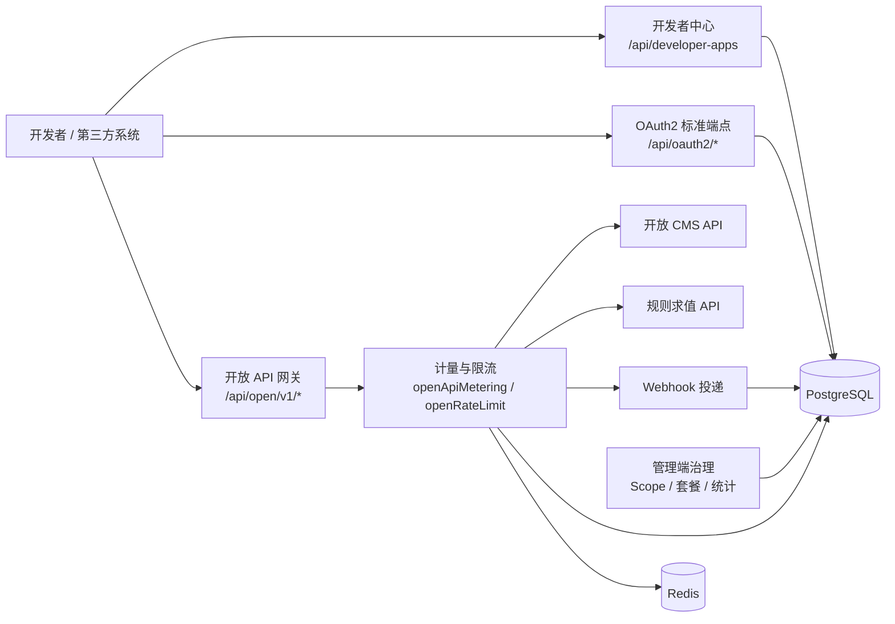

# 开放平台

开放平台为第三方系统提供应用自助、OAuth 2.1 授权、HMAC 签名网关、Scope 治理、限流套餐、调用观测、Webhook 投递、在线调试台与开放 CMS / 规则求值 API。

---

## 文档导航

| 文档 | 内容 |
| --- | --- |
| [快速接入](./quickstart.md) | 第三方接入流程、OAuth2 与 HMAC 两种调用方式、签名计算示例 |
| [应用与凭证](./apps.md) | 开发者应用、生产 / 沙箱环境、审核、密钥轮换、管理员应用管理 |
| [OAuth 2.1 授权](./oauth2.md) | 授权码 + PKCE、客户端凭证、刷新令牌、撤销、自省与 UserInfo |
| [签名与网关](./gateway-signature.md) | `/api/open/v1/*` 网关链路、双通道鉴权、HMAC-SHA256 规范与错误 |
| [Scope 与限流](./scopes-rate-limits.md) | API Scope 注册表、默认 Scope、限流套餐、配额事件 |
| [Webhook](./webhooks.md) | 应用级 Webhook 订阅、签名投递、重试、失败自动停用 |
| [调用统计与调试台](./stats-debug.md) | 调用日志、趋势聚合、导出、在线 API 调试台 |
| [开放 API 目录](./api-reference.md) | 管理端 API、开发者 API、开放网关 API 与数据表速查 |

---

## 架构总览



## 能力总览

| 能力 | 当前实现 |
| --- | --- |
| 开发者应用 | 登录用户可在「我的应用」创建应用；应用区分 `production` / `sandbox`，自助创建默认为 `draft`，提交后进入 `pending` 审核。 |
| 管理端应用治理 | 管理员可创建、编辑、审核、删除应用，查看用户授权与令牌，重置 `client_secret`，配置限流套餐、签名通道、IP/CIDR 白名单。 |
| OAuth 2.1 | 支持 `authorization_code` + PKCE S256、`client_credentials`、`refresh_token`；access token 2 小时，refresh token 30 天，授权码 10 分钟。 |
| HMAC 网关 | `/api/open/v1/*` 同时支持 Bearer token 与 `X-App-Key` + HMAC-SHA256；签名通道必须在应用上启用。 |
| Scope 管理 | `api_scopes` 注册资源级权限；应用 `allowedScopes` 决定可申请 / 可调用范围，网关按令牌或应用有效 Scope 校验。 |
| 限流套餐 | `rate_plans` 定义 QPS、每日、每月配额；沙箱环境不执行套餐限流，生产环境按应用 AppKey 计数。 |
| 调用统计 | 网关异步写入 `open_api_call_logs`，每日聚合落 `open_api_call_stats_daily`，页面提供 KPI、趋势、Top 维度、日志与导出。 |
| Webhook | 订阅应用事件；支持 `hmacSha256` / `none`，投递日志、手动重试、批量重试、测试投递与连续失败自动停用。 |
| 开放 CMS | `/api/open/v1/cms/*` 提供已发布内容读取、游标同步、内容写入、提交、发布与回收。 |
| 规则求值 | `POST /api/open/v1/rules/evaluate` 使用 `rules:evaluate` scope 调用规则中心统一求值。 |

## 运行时链路

开放网关在 `/api/open/v1/*` 上按固定顺序执行：

```text
openGatewayAuth → openApiMetering → openRateLimit → 业务端点
```

- `openGatewayAuth` 解析 OAuth2 Bearer 或 HMAC 签名，产出统一 `openPrincipal`。
- `openApiMetering` 记录调用日志，并在失败、Scope 拒绝时发出开放平台事件。
- `openRateLimit` 按套餐检查 QPS / 日 / 月配额，生产环境生效，沙箱环境跳过。

## 关键数据表

| 表 | 用途 |
| --- | --- |
| `oauth2_clients` | 应用、凭证、回调 URL、Scope、套餐、签名、环境、审核状态与归属用户 |
| `oauth2_authorization_codes` | 授权码摘要、PKCE challenge、过期时间与使用状态 |
| `oauth2_token_families` | refresh token 轮换族、撤销与重放标记 |
| `oauth2_tokens` | access / refresh token 摘要、授权 Scope、过期与撤销状态 |
| `oauth2_user_grants` | 用户对应用的授权记录 |
| `api_scopes` | API Scope 注册表 |
| `rate_plans` | 限流套餐 |
| `open_api_call_logs` | 开放 API 调用明细 |
| `open_api_call_stats_daily` | 每日聚合统计 |
| `app_webhook_subscriptions` | 应用 Webhook 订阅 |
| `app_webhook_deliveries` | Webhook 投递记录 |
| `open_quota_alerts` | 配额预警持久化 outbox |
| `cms_open_app_grants` | CMS 站点 / 栏目开放写入授权 |

