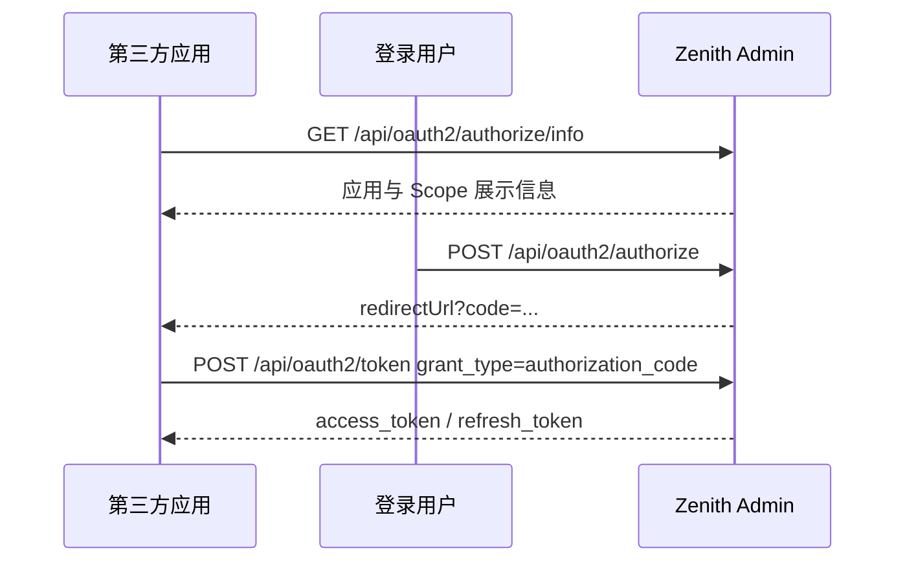

# OAuth 2.1 授权

OAuth2 标准端点挂载在 `/api/oauth2`。授权码流程强制 PKCE S256，令牌为 opaque token，数据库只保存 SHA-256 摘要。

---

## 支持的授权类型

| `grant_type` | 适用场景 | 要求 |
| --- | --- | --- |
| `authorization_code` | 第三方应用代表登录用户访问资源 | 应用允许该授权类型；回调 URL 在允许列表；必须提供 PKCE S256 |
| `client_credentials` | 服务端到服务端调用 | 机密客户端；应用允许该授权类型；`scope` 不超过应用 `allowedScopes` |
| `refresh_token` | 用户离线续期 | 应用同时启用 `authorization_code` 与 `refresh_token`；授权时包含 `offline_access` |

## 授权码 + PKCE



### 获取授权页信息

`GET /api/oauth2/authorize/info` 需要登录态，用于前端同意页展示。

| Query | 说明 |
| --- | --- |
| `client_id` | 应用 `clientId` |
| `redirect_uri` | 回调地址，必须在应用允许列表 |
| `response_type` | 仅支持 `code` |
| `scope` | 空格分隔 Scope |
| `state` | 可选透传参数 |

返回的 `requiresPkce` 固定为 `true`。

### 用户确认授权

`POST /api/oauth2/authorize` 需要登录态，请求体：

```json
{
  "client_id": "client-id",
  "redirect_uri": "https://client.example.com/callback",
  "response_type": "code",
  "scope": "openid profile email offline_access",
  "state": "opaque-state",
  "code_challenge": "43-char-base64url-sha256",
  "code_challenge_method": "S256"
}
```

成功返回业务信封，`data.redirectUrl` 含授权码。

### 兑换令牌

`POST /api/oauth2/token` 使用 `application/x-www-form-urlencoded`：

```text
grant_type=authorization_code
code=<code>
redirect_uri=https://client.example.com/callback
client_id=<client_id>
client_secret=<client_secret>    # 公开客户端不传
code_verifier=<pkce_verifier>
```

响应为 OAuth2 标准格式：

```json
{
  "access_token": "oat_xxx",
  "token_type": "Bearer",
  "expires_in": 7200,
  "refresh_token": "ort_xxx",
  "scope": "openid profile email offline_access"
}
```

## 客户端凭证

`POST /api/oauth2/token`：

```text
grant_type=client_credentials
client_id=<client_id>
client_secret=<client_secret>
scope=data:read rules:evaluate
```

返回 access token，不返回 refresh token。

## 刷新令牌

`POST /api/oauth2/token`：

```text
grant_type=refresh_token
refresh_token=<refresh_token>
client_id=<client_id>
client_secret=<client_secret>    # 公开客户端不传
```

系统按 token family 做 refresh rotation；检测到 refresh token 重放时撤销整个令牌族。

## 撤销、自省与 UserInfo

| 方法 | 路径 | 格式 | 说明 |
| --- | --- | --- | --- |
| `POST` | `/api/oauth2/token/revoke` | form-urlencoded | RFC 7009，始终返回 `{}` |
| `POST` | `/api/oauth2/token/introspect` | form-urlencoded | RFC 7662，返回 `{ active, scope, client_id, ... }` |
| `GET` | `/api/oauth2/userinfo` | `Authorization: Bearer <token>` | OIDC UserInfo 顶层 claims |

UserInfo 只接受绑定用户的 access token；`client_credentials` 令牌不含用户信息。

## 错误码

OAuth2 协议端点使用标准错误体：

```json
{ "error": "invalid_grant", "error_description": "授权码已过期" }
```

当前错误码集合：

| 错误码 | HTTP 状态 |
| --- | --- |
| `invalid_request` | 400 |
| `invalid_client` | 400 |
| `invalid_grant` | 400 |
| `unauthorized_client` | 400 |
| `unsupported_grant_type` | 400 |
| `unsupported_response_type` | 400 |
| `invalid_scope` | 400 |
| `access_denied` | 400 |
| `invalid_token` | 401 |
| `server_error` | 500 |
| `temporarily_unavailable` | 503 |

