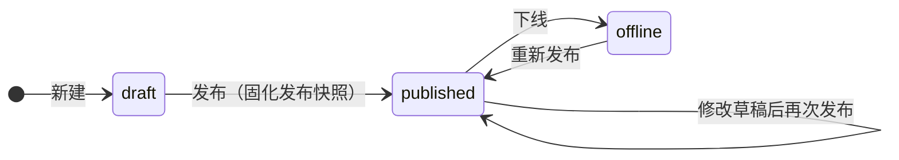

# 仪表盘设计

仪表盘是把数据集可视化为图表、指标卡、表格的画布。在「报表中心 → 仪表盘」（`/report/dashboards`）管理，点「设计」进入拖拽设计器。

## 设计器布局

设计器分三栏：

- **左侧组件面板**：按「指标 / 表格 / 图表 / 其它」分组，点击即可添加到画布。
- **中间画布**：栅格（默认 12 列）拖拽布局，拖动卡片头部移动、拖右下角缩放。
- **右侧配置面板**：选中组件后，配置数据集、字段映射与样式。

顶部工具栏：返回、名称、布局模式切换（栅格 / 大屏画布）、撤销/重做、筛选器、**轮播**（多页配置）、主题（浅色/深色，栅格模式）、大屏设置（画布模式）、预览、保存。

## 组件类型（23 种）

| 分组 | 组件 |
|------|------|
| 指标 | 指标卡（kpi）、仪表盘（gauge）、翻牌器（flipper）、水波球（liquid） |
| 表格 | 表格（table）、透视表（pivot） |
| 图表 | 柱状图、折线图、面积图、双轴图、饼图、散点图、雷达图、漏斗图、矩形树图、桑基图、词云、热力图、地图 |
| 其它 | 文本、滚动榜单（scrollList）、图片、网页（iframe） |

### 配置组件

选中组件后在右侧：

1. 选择**数据集**（文本/图片/网页组件无需数据集）。指标卡 / 仪表盘 / 翻牌器 / 水波球还可改为**直接绑定指标**（[指标中心](./metrics)定义的 metricId，与数据集二选一）——组件复用指标的口径、缓存与格式化，无需重复配置字段映射。
2. 配置**字段映射**：
   - 指标卡 / 仪表盘 / 水波球：取值字段 + 聚合方式（求和/平均/最大/最小/计数/首行）。
   - 柱/线/面积/饼/散点等：分类字段（X）+ 指标字段（Y，可多选）。
   - 桑基图：源字段 / 目标字段 / 值字段；热力图：X / Y / 值；词云：词语 / 权重。
3. 图表选项：堆叠、百分比、水平、平滑、数据标签、排序 + TopN 等。
4. **组件样式**：背景色、是否显示标题栏、无边框模式等。

### 表格增强

- **展示列**：留空=全部字段。
- **合计行**、**每页行数**（分页）。
- **条件格式**：按列阈值（≥ ≤ > < = ≠ / 介于）设置文字色或背景色。
- 字段配置了[格式化](./datasets#字段格式化与字典翻译-语义层)时，单元格自动按格式显示（货币、百分比、字典翻译等）。

### 指标卡增强

支持对比字段（环比/同比基准、显示涨跌幅）、目标值（进度条）、迷你趋势（sparkline）。

## 全局筛选器

点顶部「筛选器」管理仪表盘级筛选控件：

| 类型 | 控件 |
|------|------|
| date / daterange | 日期 / 日期范围 |
| select / multiSelect | 下拉单选 / 多选 |
| input | 文本输入 |
| numberRange | 数值范围 |

筛选器选项可来自**静态列表**或**某数据集**（取值/标签字段），并可配置控件宽度。查看页与公开分享页的筛选值会**同步到 URL 查询参数**，刷新或转发链接即恢复筛选状态。

### 参数绑定（筛选器 → 数据集参数）

若组件的数据集声明了参数，在组件配置的「参数绑定」区把**全局筛选器**绑定到**数据集参数**，筛选变化即驱动该组件重新取数，实现联动查询。

## 点击联动与钻取

- **点击联动**：开启后，点击图表的某个分类，把该值写入指定筛选器，联动刷新其它组件。
- **钻取**：点击图形可
  - 按**维度层级**下钻（fields 类型：预设字段层级如 省→市→区，点击逐层替换分类字段，支持面包屑回退），或
  - 跳**目标仪表盘**（携带点击值为参数），或
  - 跳**外链**（URL 支持 `{value}` 占位；仅允许 `http(s)` 地址，保存与点击时双重校验，并以 `noopener,noreferrer` 新窗口打开）。

> **URL 安全约束**：图片组件 `src` 只接受 `http(s)` URL 或站内路径（如托管文件 `/api/files/{id}/content`）；网页（iframe）组件 `src` 只接受 `http(s)` URL，嵌入同源页面时 sandbox 不含 `allow-same-origin`，避免被嵌入文档读取本应用会话。`javascript:` / `data:` / `file:` 等地址在保存时被拒绝，渲染时也会被过滤为空。

## 多页轮播

「轮播」设置把仪表盘分成多页（pageCount），每个组件通过 `page` 属性归属某一页；设计器顶部出现**页签切换**（含各页组件数），逐页编排。查看时按 `intervalSec` 自动轮换页面，可选页码指示点（showDots）与手动翻页。适合值班大屏多主题轮询场景，详见 [数据大屏](./data-screen)。

## 主题与自动刷新

- 主题：浅色 / 深色。
- 在「大屏设置」（画布模式）或仪表盘配置中可设**自动刷新间隔**（秒，0=关闭）。

## 发布与生命周期

仪表盘有三种生命周期状态：

- 设计器里的「保存」**仅保存草稿**，不影响对外展示；保存携带修订号（revision）乐观锁，多人同时编辑发生冲突时会返回当前修订号并提示刷新，避免互相覆盖。
- 列表点「**发布**」把当前草稿固化为**发布快照**；已发布状态下可点「**下线**」停止对外提供。
- 已发布查看、公开分享、匿名嵌入**始终读取发布快照**——继续修改草稿不会影响线上，直到再次发布。
- 草稿预览需要 `report:dashboard:update` 权限；普通查看者只能看到发布态。
- 发布类动作可纳入[资源治理](./governance)的发布审批与环境晋级流程；列表「**权限与转移**」可直达该仪表盘的 ACL 与所有权管理。

## 预览、版本与收藏

- **预览**：进入只读查看页，支持刷新、导出 PNG 图片、全屏、（有权限时）回到编辑。
- **版本历史**：保存/发布产生版本快照（来源标注 手动保存/发布/回滚等，回滚前自动生成当前状态的备份版本），可查看版本差异（diff 摘要）并随时回滚。
- **收藏 / 分类**：仪表盘可收藏、归类（分类支持管理维护），列表支持按分类与收藏筛选。
- **复制 / 批量启停**：列表可一键复制现有仪表盘作为新草稿，也可多选批量启用/停用。

## 导出与分享

- **PNG 图片导出**：预览页一键导出整屏图片。
- **公开分享 / 订阅 / 嵌入**：见 [分享 / 订阅 / 嵌入 / 协作](./sharing)。
- 需要全屏大屏展示时，把布局切换为「大屏画布」，见 [数据大屏](./data-screen)。

## 权限

| 操作 | 权限码 |
|------|--------|
| 查看 / 预览 / 评论 | `report:dashboard:list` |
| 新增 / 复制 | `report:dashboard:create` |
| 设计 / 编辑 / 发布 / 下线 / 版本 / 分享 | `report:dashboard:update` |
| 删除 | `report:dashboard:delete` |
