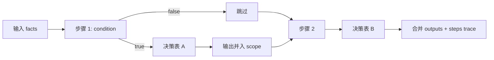

# 决策流

决策流用于把多个决策表按步骤串联执行。每一步先判断条件，再执行引用的决策表，输出会并入工作 scope，供后续步骤继续引用。

## 步骤模型

| 字段 | 说明 |
| --- | --- |
| `id` | 步骤唯一标识 |
| `tableKey` | 引用的决策表 key |
| `label` | 步骤展示名 |
| `condition` | 可选安全表达式；结果为假时跳过该步骤 |
| `outputNamespace` | 可选命名空间；为空时输出平铺合并到 scope，非空时写入 `scope[namespace]` |

执行顺序固定为页面中配置的步骤顺序。条件表达式和决策表输入表达式都读取同一个工作 scope，因此上一步输出可参与下一步判断。



## 运行态与测试态

| 场景 | 使用内容 | 留痕 |
| --- | --- | --- |
| 发布 | 将编辑态 `steps` 固化为 `publishedSteps`，写入 `rule_asset_versions` | 不求值 |
| 业务 `decide({ kind: 'flow' })` | 只执行 `publishedSteps`，步骤中的决策表也只取发布快照 | 记录流本身；未跳过的表步骤也写一条表留痕 |
| 后台测试 `/{id}/test` | 执行编辑态 `steps`；引用表优先发布快照，未发布草稿回退编辑态，禁用不可用 | source 为 `test` |
| 后台按 key 求值 `/evaluate` | 已发布流执行 `publishedSteps`，草稿流执行编辑态，禁用流报错 | caller 为 `admin.evaluate`，source 为 `manual` |

## 输出与 trace

求值返回：

```ts
interface RuleFlowEvaluateResult {
  outputs: Record<string, unknown>;
  steps: Array<{
    stepId: string;
    tableKey: string;
    label?: string;
    skipped: boolean;
    skipReason?: 'condition' | 'unavailable' | 'error';
    matched: boolean;
    outputs: Record<string, unknown>;
    matchedRowIds: string[];
    hitPolicy?: RuleHitPolicy;
    reason?: 'no_match' | 'unique_conflict' | 'any_conflict';
    error?: string;
  }>;
}
```

- `outputs` 是所有步骤输出合并后的结果。
- `skipped=true` 表示步骤未执行，`skipReason` 区分条件不满足、引用表不可用或异常。
- 步骤输出只有在命中或使用默认值回退时并入 scope。

## 生命周期与版本

| 操作 | 行为 |
| --- | --- |
| 创建 / 更新 | 写编辑态 `steps`；`key` 不可更新 |
| 发布 | 校验步骤非空、步骤 ID 不重复、条件表达式合法、输出命名空间合法，并要求引用的决策表存在且已发布 |
| 启用 / 停用 | 启用时若已有发布时间则恢复为 `published`，否则为 `draft`；停用后运行时不可用 |
| 回滚 | 从 `rule_asset_versions` 读取快照，覆盖编辑态并置为 `draft`，线上发布快照不变 |

## 删除保护

决策流删除前扫描工作流定义中的网关节点：`decisionRuleKey` 与 `decisionRefKind=flow` 精确匹配时视为引用。存在引用时拒绝删除。

## 管理 API

| 方法 | 路径 | 说明 | 权限 |
| --- | --- | --- | --- |
| GET | `/api/rules/decision-flows` | 分页列表，支持 `keyword`、`status` | `rule:flow:list` |
| GET | `/api/rules/decision-flows/{id}` | 详情 | `rule:flow:list` |
| POST | `/api/rules/decision-flows` | 创建 | `rule:flow:create` |
| PUT | `/api/rules/decision-flows/{id}` | 更新，支持 `expectedUpdatedAt` | `rule:flow:update` |
| DELETE | `/api/rules/decision-flows/{id}` | 删除 | `rule:flow:delete` |
| DELETE | `/api/rules/decision-flows/batch` | 批量删除 | `rule:flow:delete` |
| POST | `/api/rules/decision-flows/{id}/publish` | 发布并固化运行时快照 | `rule:flow:publish` |
| POST | `/api/rules/decision-flows/{id}/toggle` | 启用 / 停用 | `rule:flow:publish` |
| POST | `/api/rules/decision-flows/{id}/test` | 编辑态测试求值 | `rule:flow:evaluate` |
| POST | `/api/rules/decision-flows/evaluate` | 按 key 手动求值 | `rule:flow:evaluate` |
| GET | `/api/rules/decision-flows/{id}/versions` | 版本历史 | `rule:flow:list` |
| POST | `/api/rules/decision-flows/{id}/rollback/{version}` | 回滚到历史版本 | `rule:flow:update` |
