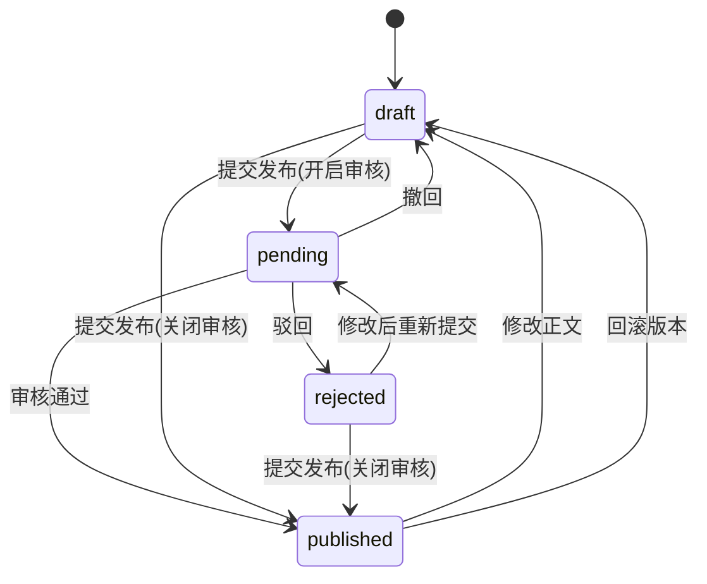

# 协作与审批

知识中心的协作能力由评论、订阅、阅读确认与发布审核组成。写入操作进入审计，通知统一通过通知中心事件派发。

## 评论

评论仅面向已发布文档。全局设置 `wiki.commentsEnabled` 关闭时，已存在评论仍可查看，但不能发表新评论。

| 能力 | 说明 |
| --- | --- |
| 评论树 | `GET /api/wiki/comments/doc/{id}` 返回顶层评论与二级回复，只展示 `visible` 评论 |
| 回复 | `parentId` 指向同文档内父评论 |
| @ 提及 | `mentionedUserIds` 存入评论，并触发 `wiki.doc.mentioned` |
| 问题评论 | `isQuestion = true` 的评论可被标记解决，写入 `resolvedAt` |
| 标记解决 | 评论作者、文档作者或空间 `admin` 及以上可操作 |
| 删除自己的评论 | 评论作者可删除；空间 `admin` 及以上也可删除任意评论 |
| 评论管理 | 管理端可按内容、状态、文档、时间范围筛选，并隐藏 / 恢复 / 删除评论 |

评论状态枚举：

| 值 | 含义 |
| --- | --- |
| `visible` | 正常 |
| `hidden` | 已隐藏 |

## 订阅与通知

文档详情支持订阅 / 取消订阅。发布新版本、评论、@ 提及和审核结果不会阻断业务主流程；通知发送失败只记录日志。

| 事件 | 触发 | 收件人 |
| --- | --- | --- |
| `wiki.doc.published` | 文档发布，包含审核通过与审批关闭时提交即发布 | 订阅者，排除当前操作者 |
| `wiki.doc.commented` | 文档收到新评论 | 文档作者与订阅者，排除评论人 |
| `wiki.doc.mentioned` | 评论中 @ 用户 | 被提及用户，排除评论人 |
| `wiki.doc.reviewed` | 文档审核通过或驳回 | 文档作者，排除审核人本人 |

以上事件默认站内信，支持邮箱渠道；评论与 @ 提及事件有每小时 10 次限流。

## 发布审批状态机

| 操作 | 接口 | 规则 |
| --- | --- | --- |
| 提交发布 | `POST /api/wiki/docs/{id}/submit` | 仅 `draft` / `rejected` 可提交；需要 `wiki:doc:publish`；审批关闭时直接发布 |
| 撤回审核 | `POST /api/wiki/docs/{id}/withdraw` | 仅 `pending` 可撤回；仅提交人或超级管理员可撤回 |
| 审核 | `POST /api/wiki/docs/{id}/review` | 仅 `pending` 可审核；`reject` 必须填写 `reason` |
| 审核时间线 | `GET /api/wiki/docs/{id}/review-records` | 记录 `submit` / `approve` / `reject` / `withdraw` |
| 我处理过的审核 | `GET /api/wiki/docs/reviews/processed` | 当前用户处理过的 `approve` / `reject` 记录 |

审核记录字段包括 `docId`、`version`、`action`、`actorId`、`reason`、`createdAt`，用于展示提交、撤回、通过、驳回的完整时间线。

## 发布审核页面

`/wiki/approvals` 包含三个 Tab：

| Tab | 数据来源 | 说明 |
| --- | --- | --- |
| 待审核 | `/api/wiki/docs?status=pending` | 可预览 Markdown；有 `wiki:approval:review` 时可通过或驳回 |
| 我提交的 | `/api/wiki/docs?submitted=true` | 查看自己的提交历史、驳回意见与审核时间线；待审文档可撤回 |
| 已处理 | `/api/wiki/docs/reviews/processed` | 当前用户通过 / 驳回过的记录 |

## 阅读确认

文档创建或编辑时可设置 `requireReadReceipt`。已发布且要求确认的文档会在阅读区提示当前用户点击确认。

| 接口 | 权限 | 说明 |
| --- | --- | --- |
| `POST /api/wiki/docs/{id}/read-receipt` | `wiki:doc:list` | 当前用户确认已读；仅适用于已发布且要求确认的文档 |
| `GET /api/wiki/docs/{id}/read-receipts` | `wiki:doc:list` | 已读 / 未读名单；仅文档作者或空间 `admin` 及以上可见 |

未确认名单来自空间成员，已确认名单来自 `wiki_doc_read_receipts`。

## 评论 API

| 方法 | 路径 | 权限 | 说明 |
| --- | --- | --- | --- |
| `GET` | `/api/wiki/comments/doc/{id}` | `wiki:doc:list` | 文档评论树 |
| `POST` | `/api/wiki/comments` | `wiki:doc:list` | 发表评论 / 回复 |
| `POST` | `/api/wiki/comments/{id}/resolve` | `wiki:doc:list` | 标记问题评论为已解决 |
| `DELETE` | `/api/wiki/comments/mine/{id}` | `wiki:doc:list` | 删除自己的评论 |
| `GET` | `/api/wiki/comments` | `wiki:comment:list` | 评论管理列表 |
| `PUT` | `/api/wiki/comments/{id}/status` | `wiki:comment:audit` | 隐藏 / 恢复评论 |
| `DELETE` | `/api/wiki/comments/{id}` | `wiki:comment:delete` | 管理端删除评论 |

