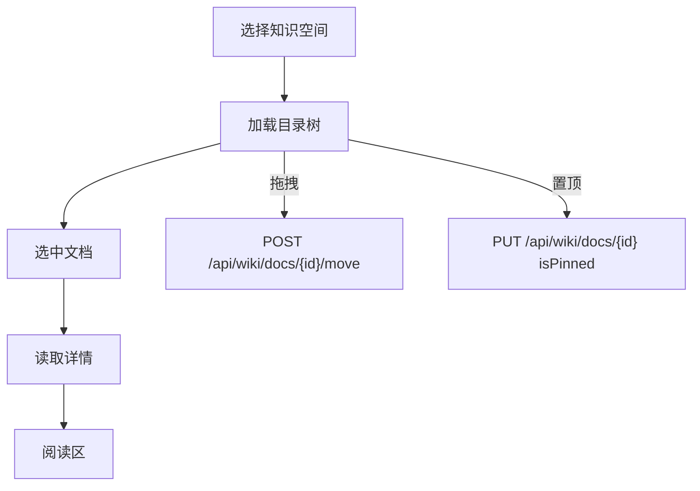

# 文档管理与阅读

文档中心使用左树右详情工作台，空间下拉决定当前文档树，详情区展示 Markdown 正文、标签、附件、评论入口和阅读辅助信息。

## 文档状态与字段

| 字段 | 说明 |
| --- | --- |
| `spaceId` / `parentId` | 所属空间与父文档；`parentId = null` 表示空间根级 |
| `title` / `summary` / `content` | 标题、摘要、Markdown 正文 |
| `status` | `draft`、`pending`、`published`、`rejected` |
| `sort` / `isPinned` | 同层排序与置顶；列表按置顶、排序、更新时间展示 |
| `currentVersion` / `revision` | 当前版本号与乐观锁版本 |
| `tagIds` / `attachments` | 标签与 `business_files` 多态附件 |
| `requireReadReceipt` | 发布后是否要求阅读确认 |
| `ownerId` / `expireAt` / `reviewCycleDays` / `nextReviewAt` / `isArchived` | 治理字段 |
| `deletedAt` | 软删除时间；非空时进入回收站 |

## 文档树

目录树由 `GET /api/wiki/docs/tree?spaceId={id}` 获取，只返回可见文档节点，不包含正文。



| 行为 | 实现语义 |
| --- | --- |
| 展开状态 | 前端按空间写入 `localStorage`：`wiki-doc-tree-expanded:{spaceId}` |
| 搜索标题 | `Tree` 使用 `titleText` 作为纯文本过滤字段 |
| 搜索态拖拽 | 过滤态下禁用拖拽，避免展示序与完整树不一致 |
| 默认选择 | 宽屏下目录有数据且未选中文档时自动选中第一篇 |
| 深链 | `?spaceId=&docId=` 与选中态双向同步；只带 `docId` 时根据详情自动切换空间 |

### 移动接口的 `index` 插入位语义

`POST /api/wiki/docs/{id}/move` 请求体：

```json
{
  "parentId": 10,
  "index": 2
}
```

| 字段 | 语义 |
| --- | --- |
| `parentId` | 目标父文档；`null` 表示移动到空间根级 |
| `index` | 目标层级在“移除自身后”的插入位置；缺省表示追加到末尾 |

服务端在事务内取出目标层级兄弟节点，移除当前文档后按 `index` 插入，并对目标层级整层重排 `sort`。兄弟文档仅让位重排时会保留原 `updatedAt` 与 `updatedBy`。

前端拖拽对应关系：

| 拖放位置 | 请求语义 |
| --- | --- |
| 拖到节点上 | `parentId = targetId`，`index = 子列表末尾` |
| 拖到节点上方 | `parentId = targetParentId`，插入到目标节点前 |
| 拖到节点下方 | `parentId = targetParentId`，插入到目标节点后；同层下移时扣除自身位置 |

## 编辑器

`/wiki/docs/edit` 是全屏 Markdown 编辑页。

| 能力 | 实现 |
| --- | --- |
| 新建入口 | `/wiki/docs/edit?spaceId={spaceId}`；子文档入口追加 `parentId={docId}` |
| 模板 | 从 `GET /api/wiki/templates/all` 读取启用模板，正文为空时填充，已有正文时追加 |
| 标签 | 从 `GET /api/wiki/tags/all` 读取全部标签 |
| 附件 | 通过通用 `FileAttachment` 写入 `business_files`，业务类型为 `wiki_doc` |
| 自动草稿 | 未保存修改每 2 秒写入 `localStorage`：`wiki-doc-draft:{id 或 new-spaceId}` |
| 乐观锁 | 编辑详情加载的 `revision` 随保存回传；冲突时服务端返回 `409` |
| 发布 | “保存并提交发布”先保存再调用提交接口 |

正文或标题变更时，服务端写入 `wiki_doc_versions` 并递增 `currentVersion`。已发布文档正文变更后回到 `draft`，并移除 AI 知识库旧副本。

## 版本历史

`/wiki/docs/history?id={docId}` 展示当前文档版本列表和行级差异。

| 能力 | 说明 |
| --- | --- |
| 版本列表 | `GET /api/wiki/docs/{id}/versions` |
| 版本详情 | `GET /api/wiki/docs/{id}/versions/{version}` |
| 对比 | 默认与上一个版本比较，也可手动选择基准版本 |
| 回滚 | `POST /api/wiki/docs/{id}/rollback`；生成一个新版本并把文档状态改为 `draft` |

## 阅读视图

| 能力 | 说明 |
| --- | --- |
| 面包屑 | 基于当前空间目录树的父链生成，可点击跳转到祖先文档 |
| 上一篇 / 下一篇 | 基于目录树先序展开结果计算阅读顺序 |
| 正文大纲 | Markdown 标题不少于 2 个时展示 TOC，点击滚动到对应锚点 |
| 滚动恢复 | 切换文档时阅读滚动容器回到顶部 |
| 站内链接 | 正文中 `/wiki/docs?docId=N` 链接被拦截为页内切换 |
| 浏览上报 | 选中文档变化时调用 `POST /api/wiki/docs/{id}/view`，已发布文档累加浏览量并写浏览日志 |

## 个人视图与检索

| Tab | 数据来源 | 说明 |
| --- | --- | --- |
| 目录 | `/api/wiki/docs/tree` | 当前空间目录树 |
| 收藏 | `/api/wiki/docs/favorites` | 当前用户收藏的可访问文档 |
| 最近 | `/api/wiki/docs/recent` | 当前用户浏览记录去重后的最近文档 |
| 我的 | `/api/wiki/docs?mine=true` | 当前用户创建的文档 |
| 搜索 | `/api/wiki/docs/search?keyword=` | 全部可访问空间全文检索 |

全文检索使用标题、摘要、正文加权排序，返回 `snippet` 命中片段。搜索首页会写 `wiki_search_logs`；点击结果调用 `/api/wiki/docs/search/click` 标记最近一次同关键词日志的 `clickedDocId`。

## 回收站

删除文档会写入 `deletedAt`，不会立即物理删除。文档存在未删除子文档时不能删除。

| 操作 | 接口 | 说明 |
| --- | --- | --- |
| 回收站列表 | `GET /api/wiki/docs/recycle` | 支持文档列表查询条件 |
| 还原 | `POST /api/wiki/docs/{id}/restore` | 父文档已删除时还原到空间根级 |
| 彻底删除 | `DELETE /api/wiki/docs/{id}/purge` | 删除文档及其版本、评论、收藏、订阅、已读记录，并清理 `business_files` |

已发布文档还原后会尝试恢复 AI 知识库同步；删除、回滚、退回草稿或彻底删除会尝试移除 AI 知识库副本。

## 文档 API

| 方法 | 路径 | 权限 | 说明 |
| --- | --- | --- | --- |
| `GET` | `/api/wiki/docs` | `wiki:doc:list` | 文档分页列表；支持 `keyword`、`spaceId`、`status`、`tagId`、`mine`、`submitted` |
| `GET` | `/api/wiki/docs/search` | `wiki:doc:list` | 全文检索；支持 `keyword`、`spaceId`、`status`、`tagId` |
| `POST` | `/api/wiki/docs/search/click` | `wiki:doc:list` | 搜索点击回报 |
| `GET` | `/api/wiki/docs/recent` | `wiki:doc:list` | 最近访问文档 |
| `GET` | `/api/wiki/docs/tree` | `wiki:doc:list` | 空间目录树，必传 `spaceId` |
| `GET` | `/api/wiki/docs/favorites` | `wiki:doc:list` | 我的收藏 |
| `GET` | `/api/wiki/docs/recycle` | `wiki:recycle:list` | 回收站列表 |
| `GET` | `/api/wiki/docs/{id}` | `wiki:doc:list` | 文档详情 |
| `POST` | `/api/wiki/docs` | `wiki:doc:create` | 创建文档 |
| `PUT` | `/api/wiki/docs/{id}` | `wiki:doc:edit` | 更新文档；正文或标题变更生成版本 |
| `DELETE` | `/api/wiki/docs/{id}` | `wiki:doc:delete` | 移入回收站 |
| `POST` | `/api/wiki/docs/{id}/move` | `wiki:doc:move` | 移动文档并重排目标层级 |
| `POST` | `/api/wiki/docs/{id}/favorite` | `wiki:doc:list` | 收藏 / 取消收藏 |
| `POST` | `/api/wiki/docs/{id}/view` | `wiki:doc:list` | 浏览上报 |
| `GET` | `/api/wiki/docs/{id}/versions` | `wiki:doc:list` | 版本历史 |
| `GET` | `/api/wiki/docs/{id}/versions/{version}` | `wiki:doc:list` | 版本详情 |
| `POST` | `/api/wiki/docs/{id}/rollback` | `wiki:doc:edit` | 回滚到历史版本 |
| `POST` | `/api/wiki/docs/{id}/restore` | `wiki:recycle:restore` | 从回收站还原 |
| `DELETE` | `/api/wiki/docs/{id}/purge` | `wiki:recycle:purge` | 彻底删除 |

