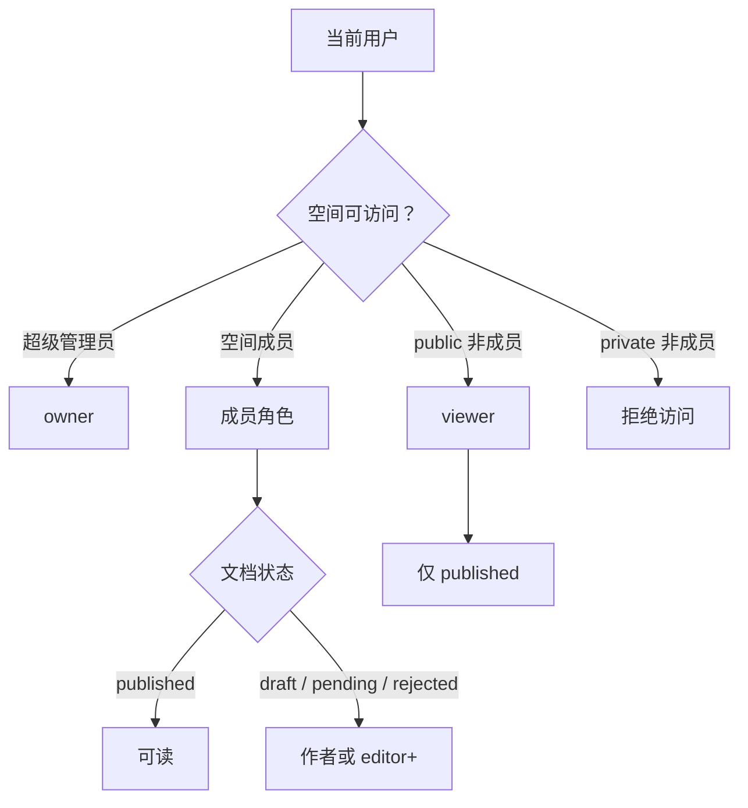

# 空间与权限

知识空间是知识中心的访问边界。文档、成员、治理、统计均围绕空间进行过滤，权限由菜单 RBAC 与空间成员角色共同决定。

## 空间模型

| 字段 | 说明 |
| --- | --- |
| `id` | 空间 ID |
| `name` / `description` / `icon` | 空间名称、说明、lucide 图标名 |
| `visibility` | `public` 全员可读；`private` 仅成员可见 |
| `status` | `enabled` / `disabled` |
| `sort` | 空间排序 |
| `aiSyncEnabled` | 空间级 AI 知识库同步开关 |
| `tenantId` | 租户边界 |
| `createdBy` / `updatedBy` / `createdAt` / `updatedAt` | 审计字段 |

## 成员角色

| 角色值 | 中文名 | 服务端语义 |
| --- | --- | --- |
| `owner` | 负责人 | 最高空间角色；可删除空空间 |
| `admin` | 管理员 | 管理空间、成员与空间内文档 |
| `editor` | 编辑者 | 可创建文档；仅能编辑自己创建的文档 |
| `viewer` | 阅读者 | 只读访问已发布文档 |

角色等级按 `viewer < editor < admin < owner` 比较。超级管理员在空间内等效为 `owner`。

## 访问边界

| 场景 | 规则 |
| --- | --- |
| 可访问空间 | 启用的公开空间，或当前用户为成员的空间；超级管理员不受限制 |
| 私有空间 | 非成员不可枚举空间内标题、摘要、标签等元数据 |
| 未发布文档 | 仅作者或空间内 `editor` 及以上可见 |
| 回收站文档 | 仅作者或空间内 `editor` 及以上可见 |
| 文档编辑 / 删除 | 文档作者或空间管理员；前端对 `editor` 仅展示自己文档的删除入口 |
| 空间删除 | 需要 `owner`，且空间下文档数为 0（含回收站） |
| 成员保存 | 全量替换，且至少保留一名 `owner` |

## 菜单与权限

知识中心菜单位于 `16000` 段。目录 / 菜单节点只负责显示，按钮节点挂载权限码。

| 页面 | 路径 | 权限码 |
| --- | --- | --- |
| 文档中心 | `/wiki/docs` | `wiki:doc:list`、`wiki:doc:create`、`wiki:doc:edit`、`wiki:doc:delete`、`wiki:doc:publish`、`wiki:doc:move` |
| 知识空间 | `/wiki/spaces` | `wiki:space:list`、`wiki:space:create`、`wiki:space:edit`、`wiki:space:delete`、`wiki:space:grant` |
| 发布审核 | `/wiki/approvals` | `wiki:approval:list`、`wiki:approval:review` |
| 文档模板 | `/wiki/templates` | `wiki:template:list`、`wiki:template:create`、`wiki:template:edit`、`wiki:template:delete` |
| 标签管理 | `/wiki/tags` | `wiki:tag:list`、`wiki:tag:create`、`wiki:tag:edit`、`wiki:tag:delete` |
| 评论管理 | `/wiki/comments` | `wiki:comment:list`、`wiki:comment:audit`、`wiki:comment:delete` |
| 回收站 | `/wiki/recycle` | `wiki:recycle:list`、`wiki:recycle:restore`、`wiki:recycle:purge` |
| 知识统计 | `/wiki/stats` | `wiki:stats:view` |
| 知识库设置 | `/wiki/settings` | `wiki:setting:view`、`wiki:setting:edit` |
| 内容治理 | `/wiki/governance` | `wiki:governance:list`、`wiki:governance:remind`、`wiki:governance:archive`、`wiki:governance:edit` |

普通用户种子角色包含知识中心只读菜单集：知识中心根、文档中心页面、文档编辑 / 版本页隐藏页面，以及 `wiki:doc:list` 查询按钮；写权限由管理员显式分配。

## 空间 API

| 方法 | 路径 | 权限 | 说明 |
| --- | --- | --- | --- |
| `GET` | `/api/wiki/spaces` | `wiki:space:list` | 空间分页列表，支持 `keyword`、`visibility`、`status` |
| `GET` | `/api/wiki/spaces/my` | `wiki:doc:list` | 当前用户可访问空间，供文档中心侧栏使用 |
| `GET` | `/api/wiki/spaces/{id}` | `wiki:space:list` | 空间详情，附带 `myRole` |
| `POST` | `/api/wiki/spaces` | `wiki:space:create` | 创建空间；创建人自动成为 `owner` |
| `PUT` | `/api/wiki/spaces/{id}` | `wiki:space:edit` | 更新空间；服务端要求空间内 `admin` 及以上 |
| `DELETE` | `/api/wiki/spaces/{id}` | `wiki:space:delete` | 删除空空间；服务端要求 `owner` |
| `GET` | `/api/wiki/spaces/{id}/members` | `wiki:space:list` | 空间成员列表 |
| `PUT` | `/api/wiki/spaces/{id}/members` | `wiki:space:grant` | 全量保存成员 |

